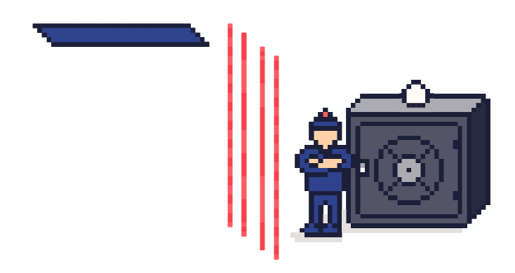
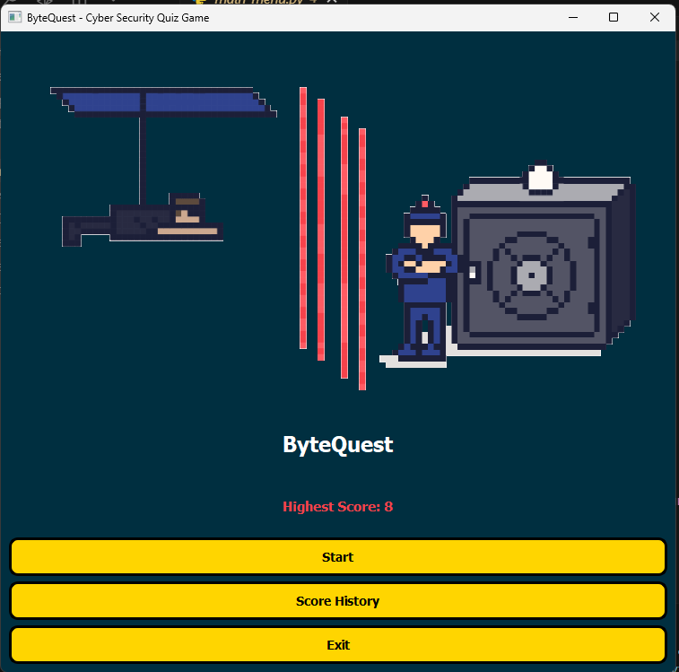
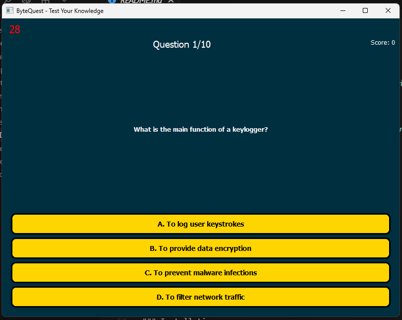
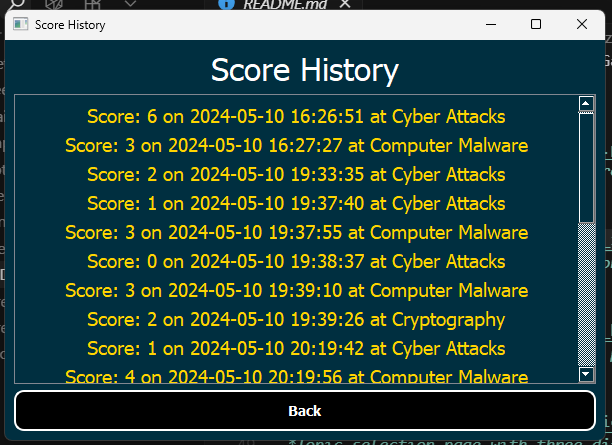
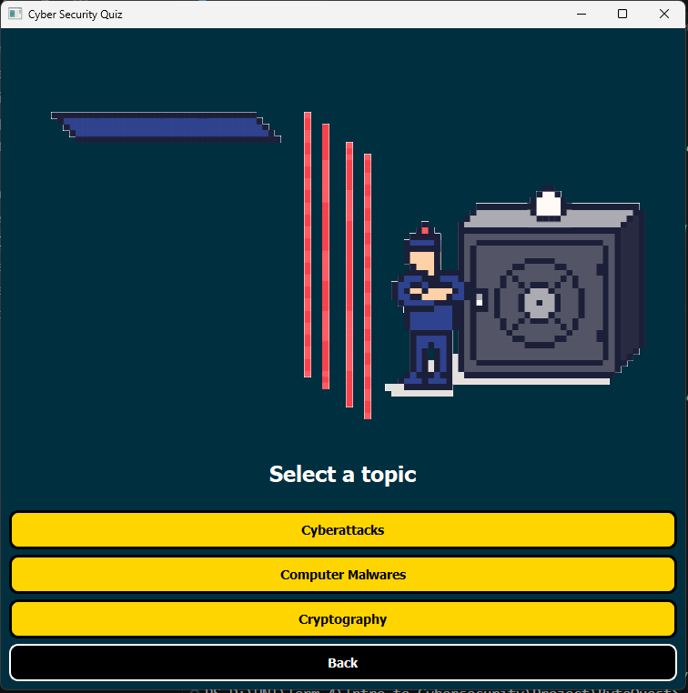
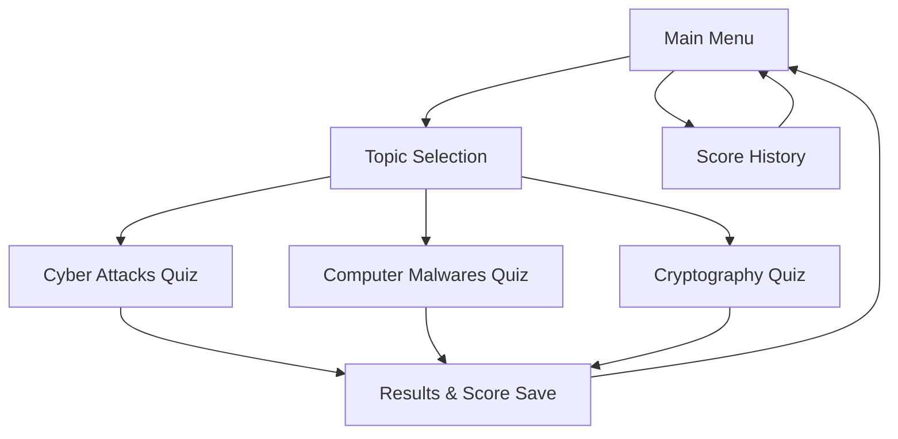

# ByteQuest - Cyber Security Quiz Game



## Overview

**ByteQuest** is an interactive cyber security knowledge testing game built with Python and PyQt5. The game aims to educate users about fundamental cyber security concepts through multiple-choice quizzes with an engaging user interface and sound effects.

## Features

### 🎮 Interactive User Interface
- Modern design with visual effects
- Animated GIF in the main menu
- Attractive colors and distinctive fonts (Press Start 2P)
- Sound effects on click and hover

### 📚 Diverse Topics
- **Cyber Attacks**: Basic cyber security and protection concepts
- **Computer Malwares**: Types of viruses and malicious software
- **Cryptography**: Encryption and digital protection concepts

### ⏱️ Timer System
- 30 seconds per question
- Visible countdown timer
- Automatic progression to next question when time expires

### 📊 Scoring System
- Real-time score tracking
- Results saved in JSON file
- Score history display with date and time
- Highest score display on main menu

## Screenshots

### Main Menu

*The main menu with animated background and topic selection*

### Quiz Interface

*The quiz interface showing questions, options, and timer*

### Score History

*Score history page displaying all previous results*

### Topic Selection

*Topic selection page with three different categories*

## Requirements

### Software Requirements
- Python 3.7 or later
- PyQt5
- Required Python libraries

### Installation
```bash
pip install PyQt5
```

## How to Run

1. **Clone the repository**
   ```bash
   git clone [repository-url]
   cd ByteQuest
   ```

2. **Install requirements**
   ```bash
   pip install PyQt5
   ```

3. **Run the game**
   ```bash
   python main_menu.py
   ```

## Project Structure

```
ByteQuest/
├── main_menu.py          # Main menu
├── topics_form.py        # Topic selection page
├── computer_malwares.py  # Malware quiz
├── cryptography.py       # Cryptography quiz
├── cyberattacks.py       # Cyber attacks quiz
├── score_page.py         # Score display page
├── scores.json          # Score storage file
├── Penetration.gif      # Animated graphics
├── screenshots/         # Screenshot images
│   ├── main_menu.png
│   ├── quiz_interface.png
│   ├── score_history.png
│   └── topic_selection.png
└── Assets/
    ├── Images/
    │   └── stacked-steps-haikei.png
    └── Sounds/
        ├── Click.wav
        ├── Correct answer.mp3
        ├── Game over.mp3
        ├── gta-click.wav
        ├── gta-hover.wav
        ├── Hover.wav
        ├── Main menu.mp3
        └── Wrong answer.mp3
```

## How to Play

1. **Start the Game**: Run `main_menu.py` to open the main menu
2. **Choose a Topic**: Select one of the three available topics
3. **Answer Questions**: 
   - Read the question carefully
   - Choose the correct answer from four options
   - You have 30 seconds per question
4. **View Results**: At the end of the quiz, your final score will be displayed
5. **Review History**: You can view all your previous results from the main menu

## Question Content

### Cyber Attacks (30 questions)
- Basic cyber security concepts
- Different types of attacks
- Protection and prevention methods
- Security best practices

### Computer Malwares (30 questions)
- Types of viruses and malicious software
- Methods of spread and infection
- How to protect and treat infections
- Anti-malware tools

### Cryptography (30 questions)
- Basic encryption concepts
- Types of encryption algorithms
- Public and private keys
- Digital signatures

## Technologies Used

- **Python 3.x**: Core programming language
- **PyQt5**: For creating the graphical user interface
- **JSON**: For saving and loading results
- **QTimer**: For timer management
- **QSound**: For sound effects
- **QMovie**: For animations

## Game Flow Diagram



## Contributing

We welcome contributions! You can contribute by:

1. Adding new questions
2. Improving the user interface
3. Adding new topics
4. Fixing bugs
5. Performance improvements

### How to Contribute

1. Fork the repository
2. Create a feature branch (`git checkout -b feature/AmazingFeature`)
3. Commit your changes (`git commit -m 'Add some AmazingFeature'`)
4. Push to the branch (`git push origin feature/AmazingFeature`)
5. Open a Pull Request

## Development Setup

### Prerequisites
- Python 3.7+
- Git
- Code editor (VS Code, PyCharm, etc.)

### Setup Instructions
1. Clone the repository
2. Create a virtual environment: `python -m venv venv`
3. Activate virtual environment:
   - Windows: `venv\Scripts\activate`
   - macOS/Linux: `source venv/bin/activate`
4. Install dependencies: `pip install -r requirements.txt`
5. Run the application: `python main_menu.py`

## Future Enhancements

- [ ] Multiplayer mode
- [ ] Difficulty levels
- [ ] More question categories
- [ ] Achievement system
- [ ] Leaderboards
- [ ] Mobile app version

## Troubleshooting

### Common Issues

**Issue**: PyQt5 installation fails
- **Solution**: Try `pip install PyQt5==5.15.9` or use conda

**Issue**: Sound effects not playing
- **Solution**: Ensure audio files are in the correct `Assets/Sounds/` directory

**Issue**: GIF not displaying
- **Solution**: Check that `Penetration.gif` is in the root directory

## License

This project is open source and available under the [MIT License](LICENSE).

## Acknowledgments

- PyQt5 community for the excellent GUI framework
- Cyber security experts who inspired the question content
- Open source contributors

## Contact

For questions or suggestions, please contact us or open an issue.

---

**Enjoy learning cyber security with ByteQuest! 🚀**

## Star History

[](https://star-history.com/#username/ByteQuest&Date)
